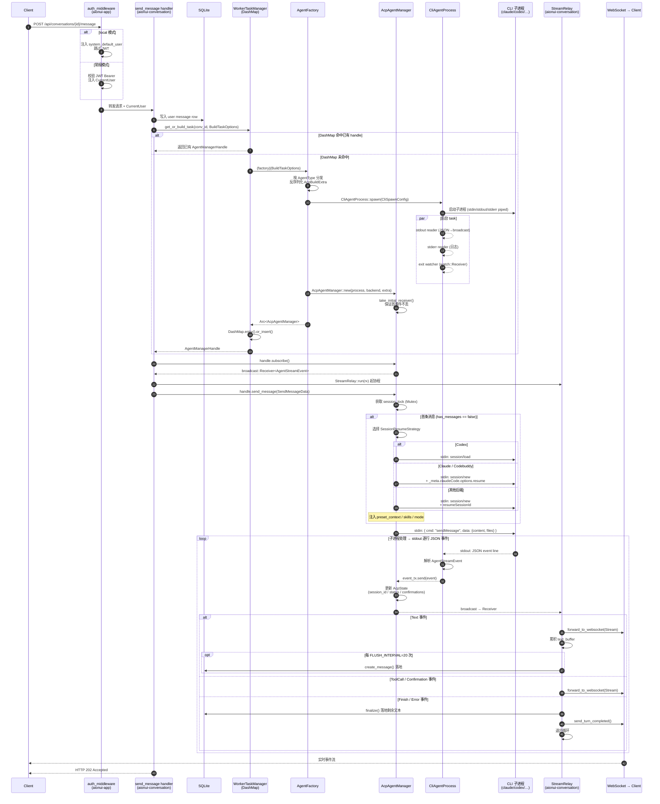

# aionui-backend 架构分析报告

**版本**: 2026-04-22（rebase 到 `origin/feat/backend-migration` 后更新）
**范围**: 整体架构 + ACP 子系统深度剖析
**代码基线**: 分支 `analysis-arch`（HEAD = `9e18da8 chore: fix cargo fmt and clippy warnings across workspace`）

---

## 第 0 章 · 结论速览

- 项目是一个 Rust Cargo workspace，共 **17 个 crate**，按 `AGENTS.md` 明确规定的**四层架构**组织：Foundation → Capability → Domain → Composition；严禁向上依赖与循环依赖，同层仅通过 trait 抽象交互。
- 顶层 `aionui-app` 基于 `axum` 组装 HTTP 服务，通过 `AppServices`（服务注入中心）+ `ModuleStates`（各域 RouterState 集合）完成装配；新增 `--local` 模式可在嵌入式部署下跳过 JWT 认证。
- **ACP（Agent Communication Protocol）** 是该项目的核心多代理执行层，集中在 `aionui-ai-agent` crate。它通过统一的 `IAgentManager` trait 把 20+ 个 CLI 后端（Claude、Codex、Qwen、Codebuddy、Opencode、Hermes、Snow …）、Gemini、Nanobot、OpenClaw、Remote、Aionrs 六大 `AgentType` 抽象到一起。
- ACP 的四个关注点落点清晰：
  - **发现**：`aionui-ai-agent/src/acp_service.rs`（内置清单 + `which` 扫描）+ `aionui-extension/src/resolvers/acp_adapter.rs`（扩展贡献）
  - **认证**：HTTP 层 JWT（可被 `--local` 旁路）；CLI 后端自带凭据；Remote Agent 加密存储 + Ed25519 签名
  - **会话编排**：`AcpAgentManager` 内部 `session_lock` + `SessionResumeStrategy`；`WorkerTaskManagerImpl` 做 per-conversation 实例池
  - **连接生命周期**：`CliAgentProcess` 管理子进程 stdio + exit watch；`idle_scanner` 清理空闲实例

---

## 第 1 章 · 整体架构

### 1.1 四层架构模型（按 `AGENTS.md`）

```
┌─ Composition ─────────────────────────────────────────────────┐
│  aionui-app                                                   │
│  · 装配 AppServices / ModuleStates                            │
│  · create_router() 拼装 axum + 中间件                         │
│  · 优雅关闭、--local 模式                                     │
└───────────────────────────┬───────────────────────────────────┘
                            │
┌─ Domain ───────────────────┴──────────────────────────────────┐
│  aionui-ai-agent (ACP 核心)、aionui-conversation、            │
│  aionui-extension、aionui-mcp、aionui-team、aionui-cron、     │
│  aionui-channel、aionui-file、aionui-office、aionui-system、  │
│  aionui-shell                                                 │
│  （域内同层仅通过 trait 交互；依赖 Foundation / Capability）  │
└───────────────────────────┬───────────────────────────────────┘
                            │
┌─ Capability ──────────────┴───────────────────────────────────┐
│  aionui-auth     (JWT / 认证中间件 / CSRF / QR)               │
│  aionui-realtime (WebSocket / BroadcastEventBus)              │
└───────────────────────────┬───────────────────────────────────┘
                            │
┌─ Foundation ──────────────┴───────────────────────────────────┐
│  aionui-common    (AgentType / AcpBackend / AppError / 时间)  │
│  aionui-api-types (ApiResponse / 跨 crate DTO, 不依赖 axum)   │
│  aionui-db        (IUserRepository / Sqlite*Repository / 迁移)│
└───────────────────────────────────────────────────────────────┘
```

**四层准则**（摘自 `AGENTS.md` 新的"Architecture Rules"小节）：
- ✅ 上层可跨层依赖下层；✅ 同层只能通过 trait 抽象交互
- ❌ 下层依赖上层；❌ 循环依赖
- Foundation 的变更需要做影响评估
- `aionui-api-types` 必须保持与 axum/tower 零耦合

### 1.2 Workspace 组成（17 crate）

| 层           | Crate                 | 核心职责                                                                       |
| ------------ | --------------------- | ----------------------------------------------------------------------------- |
| Foundation   | `aionui-common`       | 共享枚举 (`AgentType`, `AcpBackend`, `ConversationStatus`, `AppError`)、时间戳、加密工具 |
| Foundation   | `aionui-api-types`    | 跨 crate HTTP DTO (`ApiResponse<T>`、`AcpAgentInfo` 等)，不依赖 axum           |
| Foundation   | `aionui-db`           | SQLite + sqlx，仓储接口 (`IUserRepository`, `IConversationRepository`, `IRemoteAgentRepository` …) |
| Capability   | `aionui-auth`         | JWT 签发/校验、认证中间件、CSRF、Cookie、QR Token                              |
| Capability   | `aionui-realtime`     | WebSocket 管理器 (`WebSocketManager`) + 广播总线 (`BroadcastEventBus`)         |
| Domain       | **`aionui-ai-agent`** | **所有 Agent 的生命周期与 ACP 协议实现（本报告重点）**                           |
| Domain       | `aionui-conversation` | 对话 CRUD、流中继 (`StreamRelay`)、消息入库                                     |
| Domain       | `aionui-extension`    | 扩展注册表、ACP adapter / MCP provider 贡献解析                                 |
| Domain       | `aionui-mcp`          | MCP 协议客户端 & 服务端适配（Claude/Gemini/Qwen/Codex/Opencode/Codebuddy/IFlow/Aionrs/Aionui 等适配器） |
| Domain       | `aionui-team`         | 团队 / 会话 / Prompts / 调度                                                    |
| Domain       | `aionui-cron`         | 定时任务调度与执行（新增 `GET /api/cron/jobs/{id}/conversations`）              |
| Domain       | `aionui-channel`      | 外部消息通道（WeChat 等）                                                       |
| Domain       | `aionui-file`         | 文件服务 & FS 监控                                                             |
| Domain       | `aionui-office`       | Office 文档处理代理                                                            |
| Domain       | `aionui-system`       | 系统设置、模型提供商、版本                                                     |
| Domain       | `aionui-shell`        | Shell 交互（`ISystemOpener` trait 可注入）、STT 语音识别                         |
| Composition  | `aionui-app`          | 组装 + axum 启动 + CORS + 优雅关闭（产出 `aionui-backend` 二进制）              |

### 1.3 域 crate 约定（`AGENTS.md`: Domain Crate Structure）

每个域 crate 必须遵循：
- `lib.rs` — 仅做模块导出，无业务逻辑
- `routes.rs` — 导出 `domain_routes(state) -> Router`，handler 只做请求/响应转换
- `service.rs` — 业务逻辑唯一落点，**不得 import axum**
- `state.rs` — `#[derive(Clone)]` 的 RouterState，内部用 `Arc` 持依赖

### 1.4 顶层组装（`aionui-app/src/lib.rs`）

**`AppConfig`**（lib.rs:59-89）——新增 `local: bool` 字段：

```rust
pub struct AppConfig {
    pub host: String,
    pub port: u16,
    pub data_dir: String,
    /// Run in local embedded mode (skip authentication, use system_default_user).
    pub local: bool,
}
```

**`AppServices`**（lib.rs:91-106）——全局共享的单例集合：

```rust
pub struct AppServices {
    pub database: Database,
    pub jwt_service: Arc<JwtService>,
    pub user_repo: Arc<dyn IUserRepository>,
    pub cookie_config: Arc<CookieConfig>,
    pub qr_token_store: Arc<QrTokenStore>,
    pub ws_manager: Arc<WebSocketManager>,
    pub event_bus: Arc<BroadcastEventBus>,
    pub worker_task_manager: Arc<dyn IWorkerTaskManager>, // ← Agent 总控
    pub jwt_secret_raw: String,
    pub data_dir: String,
    pub local: bool,                                      // ← --local 模式开关
}
```

`AGENTS.md` 强调：**`AppServices` 是唯一的服务构造中心**，域 crate 只定义 RouterState，不自建依赖；所有装配发生在 `aionui-app` 的 `build_*_state()` 函数里。

**`ModuleStates`**（lib.rs:203-220）——每个域 crate 的 RouterState 集合，其中 `acp: AcpRouterState` 是 ACP 管理路由的入口。

**启动时序**（`main.rs`）：
1. CLI 参数解析（含 `--local`）→ 日志初始化
2. `aionui_db::init_database()` 建库 + 运行迁移
3. 构造 `AppServices::from_database_with_data_dir(db, data_dir, local)`（lib.rs:125-179），其中：
   - `derive_encryption_key(&secret)`（lib.rs:192-197）从 JWT secret 派生 32 字节 AES-GCM 密钥
   - `build_agent_factory(AgentFactoryDeps { skill_manager, remote_agent_repo, encryption_key })` 得 `AgentFactory`
   - `worker_task_manager = Arc::new(WorkerTaskManagerImpl::new(factory))`
4. 组装 `ModuleStates` → 调用 `create_router_with_all_state()`（lib.rs:605）
5. 挂 `auth_middleware`（lib.rs:617-625 起的每个路由组都 `.route_layer(auth_middleware)`）
6. 挂 CORS (`tower_http::cors::CorsLayer`，新增)
7. TCP 监听 + SIGINT/SIGTERM 优雅关闭，触发 `task_manager.clear()`

### 1.5 数据库层（`aionui-db`）

- **迁移**：`NNN_descriptive_name.sql`（`AGENTS.md` 强制），近期合并对齐 AionUi v26 schema（commit `49f1046 feat(db): consolidate migrations and align schema with AionUi v26`）。
- **Row models**：`aionui-db/src/models/`；Params 对象与仓储同文件。
- 仓储接口按域拆分，每个接口都有 `Sqlite*Repository` 实现：

| 接口 | 主要表/用途 |
|------|-------------|
| `IUserRepository` | 系统用户、JWT secret 持久化 |
| `IConversationRepository` | conversations / messages |
| `IRemoteAgentRepository` | remote_agents（URL、auth_type、加密的 auth_token、device_id/key） |
| `IProviderRepository` | 模型提供商配置 |
| `ISettingsRepository` / `IClientPreferenceRepository` | 设置 |
| `IMcpServerRepository` | MCP server 配置 |
| `ICronRepository` / `ITeamRepository` / `IChannelRepository` | 各域持久化 |
| `IOauthTokenRepository` | MCP OAuth token |

### 1.6 API 约定（`AGENTS.md`）

- 路由前缀：`/api/`；资源名：kebab-case
- 响应统一：`ApiResponse<T>`（成功）/ `ErrorResponse`（失败）
- WebSocket 事件：`domain.camelCaseAction`（两级）；`WebSocketMessage<T>` = `{ name, data }`
- 状态变更必须 CSRF 保护，敏感操作需要限流，错误响应不得泄露内部细节，密钥不得硬编码

---

## 第 2 章 · ACP 子系统总览

### 2.1 ACP 在整体中的位置

```
HTTP/WS 客户端
      │
      ▼
┌─────────────────────────────────────────────────┐
│  aionui-app (axum + CORS + auth_middleware)     │
│   ├─ /api/acp/*               → AcpRouterState  │
│   ├─ /api/conversations/{id}/* → Conversation   │
│   └─ /ws                      → realtime        │
└────────┬──────────────────────────┬─────────────┘
         │                          │
         │                          │ 订阅 AgentStreamEvent
         ▼                          ▼
┌─────────────────────────┐   ┌──────────────────┐
│ aionui-ai-agent         │   │ aionui-          │
│                         │   │ conversation     │
│  IWorkerTaskManager ────┼──▶│   StreamRelay    │
│      │                  │   └──────────────────┘
│      │ get_or_build     │            │
│      ▼                  │            ▼
│  AgentFactory           │     入库 / WS 广播
│      │ 按 AgentType 派发 │
│      ▼                  │
│  IAgentManager (dyn)    │
│  ├─ AcpAgentManager ◀── │── 重点
│  ├─ GeminiAgentManager  │
│  ├─ OpenClawAgentMgr    │
│  ├─ NanobotAgentMgr     │
│  ├─ RemoteAgentManager  │
│  └─ AionrsAgentManager  │
│        │                │
│        ▼                │
│  CliAgentProcess (stdin/stdout JSON-line)
└────────┬────────────────┘
         ▼
   子进程：claude / codex / qwen / codebuddy / opencode / hermes / snow …
```

### 2.2 `aionui-ai-agent` 模块清单（`src/lib.rs`）

| 模块 | 职责 |
|------|------|
| `agent_manager` | 定义 `IAgentManager` trait、`AgentManagerHandle`、`approval_key()` |
| `task_manager` | `IWorkerTaskManager` + `WorkerTaskManagerImpl`（per-conversation 实例池） |
| `factory` | `build_agent_factory()`：按 `AgentType` 分发到具体构造器 |
| `acp_agent` | **`AcpAgentManager`**：ACP 后端的核心实现 |
| `acp_routes` | ACP 管理 + per-conversation 会话 HTTP 路由 |
| `acp_service` | CLI 检测、健康检查、可用 agent 列表 |
| `cli_process` | **`CliAgentProcess`**：子进程 stdin/stdout/stderr + exit watch |
| `skill_manager` | ACP 技能发现、系统提示注入 |
| `stream_event` | `AgentStreamEvent` enum（Text / ToolCall / Finish / Error / Confirmation …） |
| `types` | `BuildTaskOptions`、`AcpBuildExtra`、`SendMessageData`、`AcpModelInfo` 等 DTO |
| `idle_scanner` | 后台周期扫描 + 清理空闲 ACP agent |
| `gemini_agent` / `openclaw_agent` / `nanobot_agent` / `aionrs_agent` | 其他 agent 变体 |
| `remote_agent` / `remote_agent_service` / `remote_agent_routes` | Remote Agent（WebSocket + Ed25519） |
| `api_client` | OpenAI / Anthropic / Gemini 轮换客户端 |
| `connection_test_routes` / `connection_test_service` | 模型连通性测试 |
| `auxiliary_routes` | 辅助能力（探针、工具调用等） |
| `middleware` | 消息中间件（cron 命令探测、think 标签剥离等） |

### 2.3 核心抽象：`IAgentManager` Trait

文件：`crates/aionui-ai-agent/src/agent_manager.rs:17-83`

```rust
#[async_trait::async_trait]
pub trait IAgentManager: Send + Sync {
    fn agent_type(&self) -> AgentType;
    fn status(&self) -> Option<ConversationStatus>;
    fn workspace(&self) -> &str;
    fn conversation_id(&self) -> &str;
    fn last_activity_at(&self) -> TimestampMs;

    fn subscribe(&self) -> broadcast::Receiver<AgentStreamEvent>;

    async fn send_message(&self, data: SendMessageData) -> Result<(), AppError>;
    async fn stop(&self) -> Result<(), AppError>;

    fn confirm(&self, msg_id: &str, call_id: &str, data: serde_json::Value, always_allow: bool) -> Result<(), AppError>;
    fn get_confirmations(&self) -> Vec<Confirmation>;
    fn check_approval(&self, action: &str, command_type: Option<&str>) -> bool;

    fn kill(&self, reason: Option<AgentKillReason>) -> Result<(), AppError>;
    fn as_any(&self) -> &dyn Any;   // 支持 downcast 到 AcpAgentManager 取 ACP 专属方法
}

pub type AgentManagerHandle = Arc<dyn IAgentManager>;
```

六个实现者共享这套接口。`as_any()` 让路由层在确认 `agent_type() == Acp` 后向下转型到 `AcpAgentManager` 调用 `set_mode` / `set_model` / `set_config_option` 等 ACP 专属方法（见 `acp_routes.rs:86-91`）。

### 2.4 `AgentType` & `AcpBackend` 两级分类

文件：`crates/aionui-common/src/enums.rs`

```rust
#[serde(rename_all = "lowercase")]
pub enum AgentType {
    Gemini, Acp, OpenclawGateway /* "openclaw-gateway" */, Nanobot, Remote, Aionrs,
}

#[serde(rename_all = "lowercase")]
pub enum AcpBackend {
    Claude, Gemini, Qwen, IFlow /* "iFlow" */, Codex,
    Codebuddy, Droid, Goose, Auggie, Kimi, Opencode,
    Copilot, Qoder, OpenclawGateway /* "openclaw-gateway" */,
    Vibe, Nanobot, Cursor, Kiro,
    Hermes, Snow,                          // ← 新增后端
    Remote, Aionrs, Custom,
}
```

**rebase 后的关键变化**（commit `ca50ef0 fix: align serde enums and models with AionUi database format`）：
- `CodeBuddy` → `Codebuddy`、`OpenCode` → `Opencode`（全小写对齐前端 DB schema）
- 新增两个后端：`Hermes`（CLI `hermes`）、`Snow`（CLI `snow`）

这种两级结构允许：1) 工厂派发时只看 `AgentType`；2) 在 ACP 分支内部用 `AcpBackend` 决定 CLI 二进制名、会话恢复策略、YOLO 模式映射等差异。

---

## 第 3 章 · ACP 请求全链路

### 3.1 从 HTTP 到子进程的完整调用链

```
① 客户端 POST /api/conversations/{id}/message
         │
         ▼
② axum auth_middleware                         （aionui-app/lib.rs:617-625）
   若 services.local == true → 注入 system_default_user，跳过 JWT
   否则 验 JWT Bearer → 注入 CurrentUser
         │
         ▼
③ conversation send_message handler            （aionui-conversation）
   · 写入 user message row
   · 调 worker_task_manager.get_or_build_task(id, BuildTaskOptions)
         │
         ▼
④ WorkerTaskManagerImpl::get_or_build_task     （task_manager.rs:71-91）
   · DashMap 查已有 handle → 有则直接返回
   · 无则调 (factory)(options) → DashMap.entry().or_insert()  （TOCTOU 安全）
         │
         ▼
⑤ AgentFactory 闭包                             （factory.rs:31-44）
   · 在当前 tokio Handle 上 scoped-thread + block_on
   · 按 options.agent_type 分发
         │
         ▼
⑥ AcpAgentManager::new(conv_id, workspace, AcpBuildExtra)
   · 构造 CliSpawnConfig（command / args / env / cwd）
   · CliAgentProcess::spawn() → 子进程 + 3 个后台 task
       - stdout reader：行分隔 JSON → broadcast event_tx
       - stderr reader：日志
       - exit watcher：watch::Receiver<Option<ExitStatus>>
   · take_initial_receiver() 保证首个事件不丢
   · 返回 Arc<AcpAgentManager>
         │
         ▼
⑦ 回到 send_message：
   · handle.subscribe() → broadcast::Receiver<AgentStreamEvent>
   · StreamRelay::run(rx) 起协程做「事件 → WS + DB」中继
   · handle.send_message(SendMessageData)
         │
         ▼
⑧ AcpAgentManager::send_message
   · 获取 session_lock (Mutex) 串行化
   · 若首次，按 SessionResumeStrategy 执行：
       - Codex                 → "session/load"
       - Claude / Codebuddy    → "session/new" + _meta.claudeCode.options.resume
       - 其他                  → "session/new" + resumeSessionId
   · stdin 写入 JSON 行：{ "cmd": "sendMessage", "data": { content, files, ... } }
         │
         ▼
⑨ 子进程（claude/codex/codebuddy/opencode/hermes/snow/…）处理 → stdout 逐行输出 JSON 事件
         │
         ▼
⑩ stdout reader 解析 → event_tx.send(...)
   · Text / ToolCall / Confirmation / Finish / Error
         │
         ▼
⑪ StreamRelay (aionui-conversation/src/stream_relay.rs)
   · 按事件类型 forward_to_websocket（WebSocketMessage::Conversation::Stream）
   · 累积 text_buffer，每 FLUSH_INTERVAL=20 次落地 create_message()
   · 遇 Finish/Error → finalize() + send_turn_completed()，退出循环
         │
         ▼
⑫ 客户端 WebSocket 端实时收到事件流
```

### 3.1.1 时序图（Mermaid）



### 3.2 ACP JSON 命令集（子进程 stdin）

摘自 `acp_agent.rs` 的 `protocol` 模块：

| 命令 | 含义 |
|------|------|
| `session/new` | 创建新会话 |
| `session/load` | 恢复已有会话（仅 Codex） |
| `session/cancel` | 取消当前会话 |
| `sendMessage` | 发送用户消息 |
| `confirmMessage` | 回应工具调用许可 |
| `session/getMode` / `session/setMode` | 模式切换（YOLO / bypassPermissions） |
| `session/getModelInfo` / `session/setModel` | 模型切换 |
| `session/getConfigOptions` / `session/setConfigOption` | 运行时配置 |
| `session/getSlashCommands` | 列出斜杠命令 |

### 3.3 `AcpAgentManager` 内部状态

```rust
pub struct AcpAgentManager {
    conversation_id: String,
    workspace: String,
    backend: AcpBackend,
    config: AcpBuildExtra,
    process: Arc<CliAgentProcess>,
    event_tx: broadcast::Sender<AgentStreamEvent>,
    state: RwLock<AcpState>,
    last_activity: AtomicI64,                      // 无锁读活性
    session_lock: Mutex<()>,                       // 序列化会话操作
    raw_rx: Mutex<Option<broadcast::Receiver<Value>>>, // 预订原始事件
}

struct AcpState {
    status: Option<ConversationStatus>,
    session_id: Option<String>,
    confirmations: Vec<Confirmation>,
    model_info: Option<AcpModelInfo>,
    has_messages: bool,
    approval_memory: HashMap<String, bool>,        // 会话级「永久允许」
}
```

### 3.4 会话恢复策略 & YOLO 模式

```rust
enum SessionResumeStrategy {
    SessionLoad,          // Codex
    ClaudeResumeMeta,     // Claude, Codebuddy
    ResumeSessionId,      // 其他
}

// YOLO 模式映射
fn yolo_mode_value(backend: AcpBackend) -> Option<&'static str> {
    match backend {
        AcpBackend::Claude | AcpBackend::Codebuddy => Some("bypassPermissions"),
        AcpBackend::Qwen | AcpBackend::IFlow       => Some("yolo"),
        _ => None,
    }
}
```

由 `SessionResumeStrategy::for_backend(AcpBackend)` 在首次发消息前决定走哪条恢复路径，隔离了不同后端的协议差异。

---

## 第 4 章 · ACP 四大关注点

### 4.1 Agent 发现（Agent Discovery）

**两条并行路径**：

1. **内置已知清单**（`acp_service.rs`）
   - `cli_binary_name(AcpBackend) -> Option<&'static str>`：硬编码后端到可执行名的映射（`Claude → "claude"`、`Qwen → "qwen"`、`Hermes → "hermes"`、`Snow → "snow"` …）。非 CLI 型后端（`IFlow` / `Gemini` / `Remote` / `Aionrs` / `Custom` / `OpenclawGateway`）返回 `None`。
   - `known_agents() -> Vec<AcpAgentInfo>`：预置 8 个显示用的主流后端（`codebuddy` 条目已对齐 `AcpBackend::Codebuddy`、`opencode` 对齐 `Opencode`）。
   - `get_available_agents()`：在 `known_agents()` 基础上用 `which::which(binary).is_ok()` 判定 `available`。
   - 暴露路由：
     - `GET  /api/acp/agents`          列出 + 可用状态
     - `POST /api/acp/agents/refresh`  重新扫描
     - `POST /api/acp/detect-cli`      针对单个 backend 返回 CLI 绝对路径
     - `POST /api/acp/health-check`    CLI 可用性 + 探测延迟
     - `GET  /api/acp/env`             读 PATH/HOME/USER/SHELL/LANG/TERM
     - `POST /api/acp/agents/test`     测试自定义 agent 命令是否在 PATH

2. **扩展贡献**（`aionui-extension/src/resolvers/acp_adapter.rs`）
   - 扩展 manifest 中 `contributions.acp_adapters[]` 字段描述：id、name、cli_command、env 模板、avatar、auth_required、supports_streaming、connection_type（如 `stdio`）、endpoint、models、yolo_mode、health_check、api_key_fields。
   - `resolve_acp_adapter()` 负责：
     - `resolve_env_map()` 展开 `${VAR}` 环境变量模板
     - 把 `avatar` 相对路径解析成扩展目录下的绝对路径
     - 产出 `ResolvedAcpAdapter` 给 `ExtensionRegistry` 聚合
   - 客户端通过扩展注册表发现第三方提供的 ACP agent。

**结论**：Agent 发现 = 「PATH 扫描（内置后端）+ 扩展贡献（第三方）」，两者最终都归并到同一种 `AcpBackend` 分类并通过 `AcpBuildExtra.cli_path` 落到子进程启动参数。

### 4.2 Agent 认证（Agent Authentication）

**四层认证（含 `--local` 新增路径）**：

| 层级 | 位置 | 机制 |
|------|------|------|
| API 入口（常规） | `aionui-app/lib.rs:617-625` | axum `auth_middleware`（`aionui-auth`）校验 JWT Bearer，注入 `CurrentUser`；所有 ACP 路由都在此中间件之后 |
| API 入口（local 模式） | `AuthState { local: true }` → `auth_middleware` | **新增**：`--local` 启动时跳过 JWT 校验，直接注入 `system_default_user`；适合嵌入式/桌面单用户部署（commit `1e0235e feat(app): add --local mode to skip JWT authentication`） |
| 子进程认证 | `CliSpawnConfig.env` | 由 `AcpBuildExtra` / 扩展 manifest 注入环境变量（如 `ANTHROPIC_API_KEY`），由 CLI 自行持有；aionui 不做代理认证 |
| Remote Agent 认证 | `factory.rs:92-127` + `remote_agent_service.rs` | `RemoteAgentRow.auth_token` 以 AES-GCM 加密存入 SQLite，工厂构造时用 `aionui_common::decrypt_string` 解出；Remote Agent 另有 `device_id` + Ed25519 `device_key` 做设备签名 |
| 会话内批准 | `AcpAgentManager::confirm` + `approval_memory` | 用户回答工具调用 `Confirmation` 时可 `always_allow=true`，以 `approval_key(action, command_type)` 写入会话级记忆；后续同类请求由 `check_approval()` 命中 |

加密密钥来源：`AgentFactoryDeps.encryption_key: [u8; 32]` 由 `derive_encryption_key(&jwt_secret_raw)` 用 `SHA-256("aionui-encryption-key:" + secret)` 派生（lib.rs:192-197）。**隐含约束**：旋转 JWT secret 会使已加密的 remote auth_token 全部失效——运维文档需明确。

### 4.3 会话编排（Session Orchestration）

**核心不变量**：每个 `conversation_id` 同时最多一个活跃 agent。

| 职责 | 文件 | 实现要点 |
|------|------|----------|
| 会话级实例池 | `task_manager.rs` | `DashMap<String, AgentManagerHandle>`；`get_or_build_task` 用 `DashMap::entry().or_insert()` 避免 TOCTOU；`kill(id)` = `remove` + `agent.kill()` |
| 工厂分发 | `factory.rs:46-134` | 按 `AgentType` 匹配，各自反序列化 `options.extra` 为强类型 `AcpBuildExtra` / `GeminiBuildExtra` / `RemoteBuildExtra` |
| ACP 会话创建 | `acp_agent.rs:130-161` | `new()` 生成进程 + broadcast channel + 预订 raw_rx，`RwLock<AcpState>` 存运行期状态 |
| 首次消息初始化 | `AcpAgentManager::send_message` | 以 `session_lock` 串行化；若 `!has_messages`，执行 `session/new|load`、注入模型与技能，等待 ACP 返回 `session_id` |
| 运行期调节 | `acp_routes.rs:168-258` | `GET/PUT /api/conversations/{id}/acp/{mode\|model\|config}`：先 `require_acp_task` + `downcast_acp` 再转调 ACP 专属方法，结果通过事件流异步回送 |
| 流中继 | `aionui-conversation/src/stream_relay.rs` | 订阅 `AgentStreamEvent`，按 `FLUSH_INTERVAL=20` 把累积文本写 DB，终止事件触发 `finalize` + `send_turn_completed` |
| Cron 触发会话 | `aionui-cron/src/executor.rs` + `CronRouterState.conversation_service` | 新增 `GET /api/cron/jobs/{id}/conversations`；定时任务可通过 `ConversationService` 主动创建会话并交给 `worker_task_manager` |
| 技能注入 | `skill_manager.rs` | `prepare_first_message_with_skills_index` / `build_system_instructions_with_skills_index` 把启用的技能编织进首条消息的 system prompt |

### 4.4 连接生命周期（Connection Lifecycle）

```
 spawn()                 send_message loop            Finish/Error           idle>5min
   │                          │                          │                      │
   ▼                          ▼                          ▼                      ▼
 Pending ──▶ Running(session_id 确定) ──▶ Finished(broadcast 保留) ──▶ kill(IdleTimeout)
                                                            │
                                                            └─ 用户主动：kill(None)
```

| 阶段 | 关键代码 |
|------|----------|
| 启动 | `CliAgentProcess::spawn(config)`：`Command::new + Piped stdin/stdout/stderr`，spawn 3 个后台 task |
| 运行 | stdin `Mutex<Option<ChildStdin>>` 保证单写；stdout 事件用 `broadcast::Sender<Value>` 广播，多订阅者（原始流 + 语义流 + 测试用 raw_rx）共存 |
| 终态感知 | `watch::Receiver<Option<ExitStatus>>`：订阅者能直接 `await` 退出；`AgentStreamEvent::Finish/Error` 也通过事件流广播 |
| 空闲清理 | `idle_scanner::start_idle_scanner()` 后台 task 每 60s 调 `task_manager.collect_idle(5min)` → 对命中的 ACP agent 执行 `kill(Some(IdleTimeout))`（仅 ACP 类型参与，`task_manager.rs:115-128`） |
| 显式终止 | `IAgentManager::kill(reason)` + `task_manager::kill(id, reason)`；`clear()` 用于整体关停 |
| 优雅关闭 | `main.rs` 捕获 SIGINT/SIGTERM，axum `with_graceful_shutdown` 让 router 停止接单后 `task_manager.clear()` 清空所有子进程 |

---

## 第 5 章 · 关键数据结构速查

```rust
// aionui-common/src/enums.rs
enum AgentType  { Gemini, Acp, OpenclawGateway, Nanobot, Remote, Aionrs }
enum AcpBackend {
    Claude, Gemini, Qwen, IFlow, Codex,
    Codebuddy, Droid, Goose, Auggie, Kimi, Opencode,
    Copilot, Qoder, OpenclawGateway, Vibe, Nanobot,
    Cursor, Kiro, Hermes, Snow, Remote, Aionrs, Custom,
}
enum ConversationStatus { Pending, Running, Finished }
enum AgentKillReason    { IdleTimeout /* ... */ }

// aionui-ai-agent::types
struct BuildTaskOptions { agent_type, workspace, model, conversation_id, extra: Value }
struct AcpBuildExtra    { backend, cli_path, args, env, enabled_skills, yolo_mode, ... }
struct SendMessageData  { content, files, msg_id, ... }

// aionui-ai-agent::stream_event
enum AgentStreamEvent { Text(..), ToolCall(..), Confirmation(..), Finish(..), Error(..), ... }
```

---

## 第 6 章 · 关键文件索引

| 关注点 | 文件 : 行号 |
|--------|------------|
| `AgentType` / `AcpBackend` 枚举 | `crates/aionui-common/src/enums.rs:16-45` |
| `IAgentManager` trait | `crates/aionui-ai-agent/src/agent_manager.rs:17-83` |
| `WorkerTaskManagerImpl` | `crates/aionui-ai-agent/src/task_manager.rs:52-129` |
| `AgentFactory` 分发 | `crates/aionui-ai-agent/src/factory.rs:46-134` |
| `AcpAgentManager` 结构 | `crates/aionui-ai-agent/src/acp_agent.rs:99-126` |
| `SessionResumeStrategy` | `crates/aionui-ai-agent/src/acp_agent.rs:39-58` |
| YOLO 模式映射 | `crates/aionui-ai-agent/src/acp_agent.rs:60-68` |
| ACP 协议命令常量 | `crates/aionui-ai-agent/src/acp_agent.rs` `mod protocol` |
| 子进程生成 | `crates/aionui-ai-agent/src/cli_process.rs:59-157` |
| ACP HTTP 路由 | `crates/aionui-ai-agent/src/acp_routes.rs:32-258` |
| Agent 发现 / 健康检查 | `crates/aionui-ai-agent/src/acp_service.rs:15-181` |
| 扩展 ACP 发现 | `crates/aionui-extension/src/resolvers/acp_adapter.rs:13-44` |
| 流中继 | `crates/aionui-conversation/src/stream_relay.rs:20-93` |
| 空闲扫描 | `crates/aionui-ai-agent/src/idle_scanner.rs` |
| `AppConfig` / `AppServices`（含 `local`） | `crates/aionui-app/src/lib.rs:59-89, 91-180` |
| `ModuleStates` | `crates/aionui-app/src/lib.rs:203-220` |
| `derive_encryption_key` | `crates/aionui-app/src/lib.rs:192-197` |
| `create_router_with_all_state` + `AuthState { local }` | `crates/aionui-app/src/lib.rs:605-665` |
| `--local` 模式 E2E 测试 | `crates/aionui-app/tests/local_mode.rs` |
| ACP 集成测试 | `crates/aionui-ai-agent/tests/acp_agent_integration.rs` |
| `AGENTS.md` 架构规则 | `AGENTS.md`（Architecture Rules 小节） |
| 周边 API Spec 文档 | `docs/api-spec/*.md`（MCP、Office、Shell、Pet、Extension、App、Skill 等） |

---

## 第 7 章 · 设计亮点与可优化点

### 亮点
1. **单一 trait + 六实现**：`IAgentManager` 把异构代理（本地 CLI、Gemini API、WebSocket 远程、纯 Rust 实现）统一到同一套调度入口。
2. **零拷贝事件扇出**：`tokio::sync::broadcast` 让一条事件同时喂给 `StreamRelay`（DB + WS）、测试 `raw_rx`、未来的审计订阅者。
3. **TOCTOU 安全的实例池**：`DashMap::entry().or_insert()` 天然避免并发首次创建时的重复 spawn。
4. **协议差异的策略化**：`SessionResumeStrategy` 把 Claude / Codex / 其他的会话恢复语义差异吸收在一个枚举里；YOLO 模式映射同样走策略函数。
5. **扩展化的 Agent 发现**：内置清单 + manifest 贡献并行，无需重编译即可接入新 CLI（`Hermes`、`Snow` 就是近期新增的内置后端）。
6. **部署形态分层**：常规 JWT 多用户 / `--local` 单用户嵌入式，两种模式共用同一份中间件链，仅在 `AuthState.local` 分叉。
7. **架构规则文档化**：`AGENTS.md` 把四层依赖、域 crate 结构、API / WS / DB 规范、测试失败处理原则都落成了硬性规则，降低了后续维护熵增。

### 可留意的点
1. **`encryption_key` 与 JWT secret 耦合**：`derive_encryption_key(&jwt_secret)` 把加密密钥绑在 JWT secret 上，一旦用户轮换 JWT，`remote_agents.auth_token` 会全部解不开；建议将加密密钥独立持久化或做迁移路径。
2. **非 ACP agent 不参与空闲清理**：`collect_idle` 里硬编码 `agent_type == Acp`（`task_manager.rs:122`），Gemini/OpenClaw/Remote 的长连接目前只能靠 `kill()` 或进程退出清理。若未来有长会话泄漏风险，需要扩展清理策略。
3. **`GET /api/acp/.../mode|model|config` 的同步响应为空**：实际数据通过事件流回送（`acp_routes.rs:179-183, 232-237`）。前端需要同时订阅 WS；REST 单独调用无法拿到值——这是设计选择，但需要在 API 文档中明确说明。
4. **`probe_model` 尚未接入真实 ACP**：目前仅做 CLI 可用性检查（`acp_routes.rs:150-165`，注释标注 6.15 时对接），是个已知的实现缺口。
5. **`scoped thread + block_on` 构造 agent**：`factory.rs:38-43` 通过新起线程阻塞等待异步构造完成，兼容单线程测试 runtime，但在高并发下会创建大量短命线程，必要时可改成在工厂入口即异步化（修改 `AgentFactory` 签名为 async）。
6. **`--local` 模式的信任边界**：该模式把 `system_default_user` 直接注入所有请求，默认应仅监听本机 loopback；若被错误暴露到公网会丧失所有 API 层鉴权——需要在启动日志和文档中显式告警。
7. **`ARCHITECTURE.md` 尚未存在**：`AGENTS.md` 的 Architecture Rules 小节引用了 `ARCHITECTURE.md` 作为详细背景说明，但仓库内目前没有该文件；是一个待补的文档缺口。

---

*文档结束*
